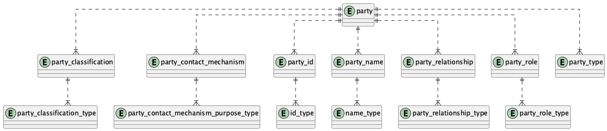
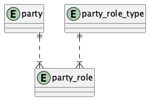
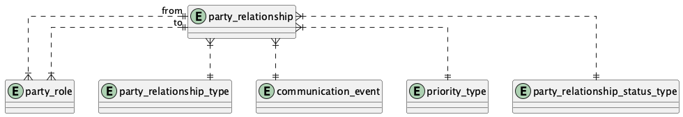
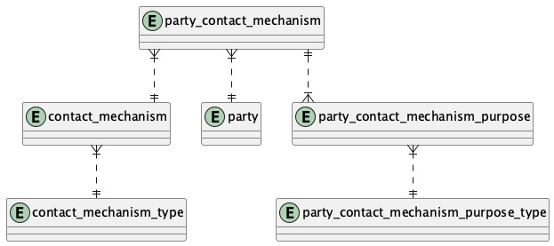
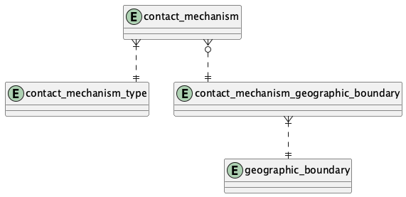
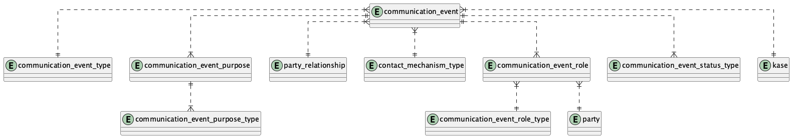
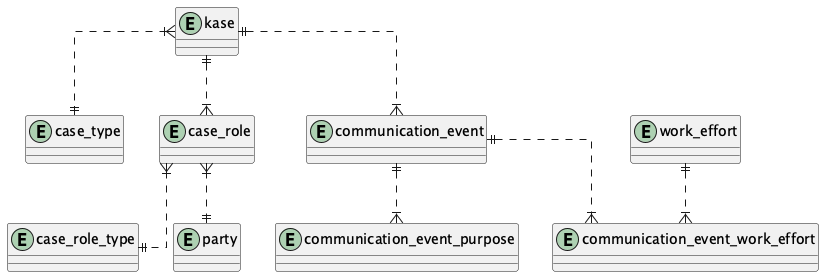
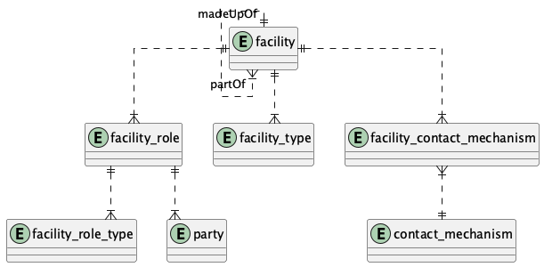
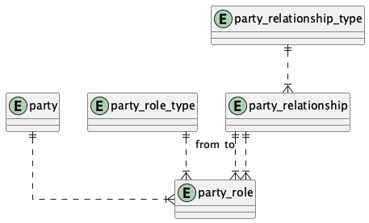
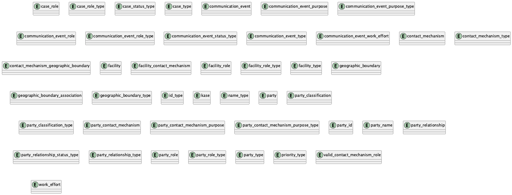

# People and Organizations Database

## Overview

This database is designed to store and manage information about people and organizations, their relationships, contact mechanisms, roles, and communication events. It provides a flexible and comprehensive data model for tracking various aspects of parties (people or organizations) and their interactions.

Key features of the database include:

- **Party Management**: Store information about parties (people or organizations), including their names, IDs, classifications, and types.
- **Relationships**: Track relationships between parties, including the roles they play in those relationships.
- **Contact Mechanisms**: Manage various ways to contact parties, such as email addresses, phone numbers, and postal addresses.
- **Communication Events**: Record communications between parties, including the purpose, status, and type of communication.
- **Facilities**: Track information about physical locations and their relationships to parties.
- **Case Management**: Manage cases or issues that involve parties and communication events.

## Entity Relationship Diagrams (ERDs)

The database schema is represented by several Entity Relationship Diagrams (ERDs) in PNG format. These diagrams provide a visual representation of the database structure and the relationships between entities.

### Available Diagrams

1. **Party.png**: Represents the core party entities and their relationships.
   

2. **PartyRole.png**: Shows the roles that parties can play.
   

3. **PartyRelationship.png**: Illustrates the relationships between parties.
   

4. **PartyContactMechanism.png**: Depicts how parties are associated with contact mechanisms.
   

5. **ContactMechanism.png**: Shows the structure of contact mechanisms.
   

6. **PostalAddressInformation.png**: Provides details about postal addresses.
   

7. **CommunicationEvent.png**: Represents communication events between parties.
   

8. **CommunicationEventFollowUp.png**: Shows follow-up actions related to communication events.
   

9. **Facility.png**: Depicts facilities and their relationships to parties.
   

10. **SpecificPartyRelationships.png**: Illustrates specific types of relationships between parties.
    

11. **Entities.png**: Contains definitions for all entities used in the other diagrams.
    

### Diagram Explanations

- **Party Diagrams**: These diagrams (Party.png, PartyRole.png, PartyRelationship.png) show how parties are structured and how they relate to each other. Parties can be people or organizations, and they can play various roles in relationships with other parties.

- **Contact Mechanism Diagrams**: These diagrams (PartyContactMechanism.png, ContactMechanism.png, PostalAddressInformation.png) illustrate how contact information is stored and associated with parties. Contact mechanisms can include email addresses, phone numbers, postal addresses, and more.

- **Communication Event Diagrams**: These diagrams (CommunicationEvent.png, CommunicationEventFollowUp.png) show how communications between parties are recorded, including the purpose, status, and type of communication, as well as any follow-up actions.

- **Facility Diagrams**: The Facility.png diagram depicts physical locations and how they relate to parties and contact mechanisms.

- **Entity Definitions**: The Entities.png file contains definitions for all entities used in the other diagrams, providing a central reference for entity structures.

## Usage

The database can be used to support applications that need to manage information about people and organizations, such as CRM systems, ERP systems, or custom business applications.

To use the database:

1. Create the database schema using the SQL scripts in the `sql` directory.
2. Populate the database with initial data as needed.
3. Connect your application to the database and start managing party information.

## License

See the LICENSE file for details.
