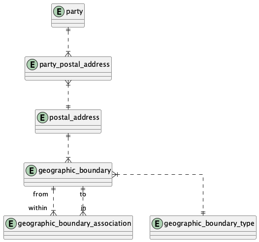

# People and Organizations Database

## Overview

This database is designed to store and manage information about people and organizations, their relationships, contact mechanisms, roles, and communication events. It provides a flexible and comprehensive data model for tracking various aspects of parties (people or organizations) and their interactions.

Key features of the database include:

- **Party Management**: Store information about parties (people or organizations), including their names, IDs, classifications, and types.
- **Relationships**: Track relationships between parties, including the roles they play in those relationships.
- **Contact Mechanisms**: Manage various ways to contact parties, such as email addresses, phone numbers, and postal addresses.
- **Communication Events**: Record communications between parties, including the purpose, status, and type of communication.
- **Facilities**: Track information about physical locations and their relationships to parties.
- **Case Management**: Manage cases or issues that involve parties and communication events.

## Entity Relationship Diagrams (ERDs)

The database schema is represented by several Entity Relationship Diagrams (ERDs) in PNG format. These diagrams provide a visual representation of the database structure and the relationships between entities.

### Available Diagrams

1. **Party.png**: Represents the core party entities and their relationships.
   

   This diagram shows how parties are structured and how they relate to each other. Parties can be people or organizations, and they can play various roles in relationships with other parties.

2. **PartyRole.png**: Shows the roles that parties can play.
   

   This diagram illustrates the different roles that parties can assume in various contexts, such as customer, supplier, employee, etc.

3. **PartyRelationship.png**: Illustrates the relationships between parties.
   

   This diagram shows how parties can be related to each other through different types of relationships, such as employment, partnership, or customer-supplier relationships.

4. **PartyContactMechanism.png**: Depicts how parties are associated with contact mechanisms.
   

   This diagram illustrates how contact information is stored and associated with parties, including the purpose of each contact mechanism.

5. **ContactMechanism.png**: Shows the structure of contact mechanisms.
   

   This diagram details the different types of contact mechanisms and how they are structured, including their relationships with geographic boundaries.

6. **PostalAddressInformation.png**: Provides details about postal addresses.
   

   This diagram shows how postal addresses are structured and related to geographic boundaries, allowing for detailed address information.

7. **CommunicationEvent.png**: Represents communication events between parties.
   

   This diagram shows how communications between parties are recorded, including the purpose, status, and type of communication.

8. **CommunicationEventFollowUp.png**: Shows follow-up actions related to communication events.
   

   This diagram illustrates how follow-up actions related to communication events are tracked, including cases and work efforts.

9. **Facility.png**: Depicts facilities and their relationships to parties.
   

   This diagram depicts physical locations and how they relate to parties and contact mechanisms, including facility roles and types.

10. **SpecificPartyRelationships.png**: Illustrates specific types of relationships between parties.
    

    This diagram provides a more detailed view of specific types of relationships between parties, showing how party roles are involved in these relationships.

11. **Entities.png**: Contains definitions for all entities used in the other diagrams.
    

    This diagram provides a central reference for all entity structures used in the database, showing their attributes and relationships.

## Usage

The database can be used to support applications that need to manage information about people and organizations, such as CRM systems, ERP systems, or custom business applications.

To use the database:

1. Create the database schema using the SQL scripts in the `sql` directory.
2. Populate the database with initial data as needed.
3. Connect your application to the database and start managing party information.

## License

See the LICENSE file for details.
